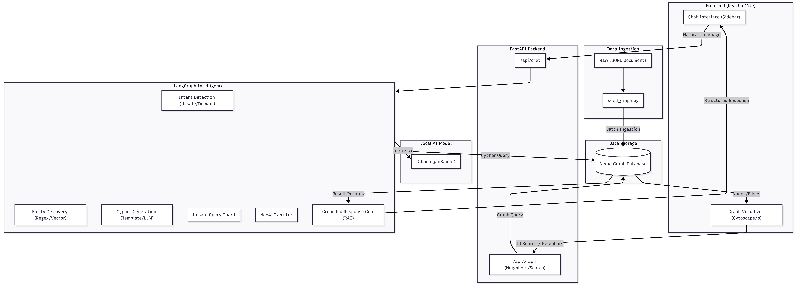
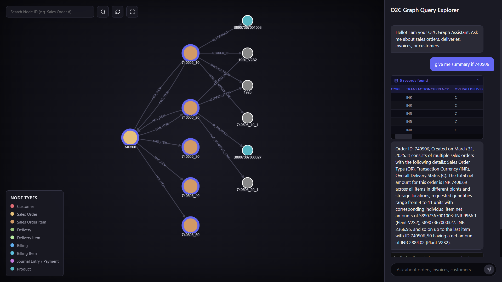

# Order-to-Cash (O2C) Graph-Based Query System

A full-stack intelligent dashboard for exploring Order-to-Cash process data. The system automatically ingests fragmented document records (.jsonl) into a standardized Neo4j Graph, provides dynamic Cytoscape visual traversals, and integrates a LangGraph powered Natural Language-to-Cypher agent for intelligent data extraction.

## Features

- **Automated Graph Ingestion**: Parse Business Partners, Orders, Deliveries, Billing, and Payments into unified graph relationships.
- **Natural Language Interface**: LangGraph + LangChain agent dynamically translates user queries into safe, read-only Cypher queries. Built-in intent detection blocks unrelated requests and data modification attempts (e.g. DELETE/MERGE).
- **Interactive Visual Explorer**: React + Cytoscape.js frontend for live neighborhood traversal and visualization of order lifecycles.

## Tech Stack
- **Graph Database**: Neo4j (Local)
- **Backend**: FastAPI, Python 3.10+, LangGraph, LangChain, Neo4j Driver
- **LLM Engine**: Local Ollama (`llama3.2:1b`)
- **Frontend**: React, Vite, Cytoscape.js, vanilla CSS variables (for premium dark aesthetic).

## System Architecture


## Dashboard Preview



## Prerequisite Setup

### 1. Neo4j Local Database
Ensure you have a local Neo4j desktop instance running. 
- Create a project with empty graph.
- Setup a password (default expected: `password` with user `neo4j`).
- Ensure it runs at `bolt://localhost:7687`.

### 2. Environment Setup
You'll need Ollama installed and the `llama3.2:1b` model pulled locally.

```bash
ollama run llama3.2:1b
```

## Running the Architecture

### 1. Ingest Data to Neo4j
Run the seeding script to compile CSV fragments into the graph context.
```bash
cd backend
python -m venv venv
.\venv\Scripts\activate
pip install -r requirements.txt
python ingestion/seed_graph.py
```
> The script sequentially enforces constraints, parses the Customer, Order, Delivery, Billing, Payment items, and interlinks them. 

### 2. Start the FastAPI Backend
```bash
cd backend
.\venv\Scripts\activate
uvicorn main:app --port 8000
```
> Backend runs at `http://localhost:8000`.

### 3. Start the React Frontend
```bash
cd frontend
npm install
npm run dev
```
> Explore the visual dashboard at the Vite server url (usually http://localhost:5173).

## Usage Examples

In the UI Chat Sidebar, try queries like:
- "What is the status of sales order 5000000021?"
- "Has SalesOrder 5000000021 been billed yet and what was the payment amount?"
- "What products were included in outbound delivery 800010?"
- *(Intent Reject)* "Delete the dataset." -> The LLM will prevent execution.

## Technical Approach

- **Intent-Driven Workflow**: Uses LangGraph to classify user queries into `domain_query`, `unsafe`, or `general` before processing.
- **Hybrid Query Strategy**: Combines high-speed Regex templates for common patterns with an LLM fallback (`phi3:mini`) for arbitrary natural language.
- **Relationship-Centric Results**: Every query is optimized to return both nodes and their interconnecting relationships (`MATCH (n)-[r]->(m) RETURN n,r,m`) ensuring a connected, traversable graph in the UI.
- **Safe Execution Layer**: Validations prevent data modification (DELETE/SET/MERGE) even if the LLM generates them.

## Difficulties Faced

- **LLM Hallucinations**: Small local models (1B-3B) occasionally hallucinated internal properties. This was mitigated by strict schema injection and few-shot prompt templates.
- **Visualization Cohesion**: Initial results showed isolated nodes. We shifted to returning full paths or explicit relationships to provide visual context.
- **Rate-Limit Handling**: Implemented custom error-boundary nodes in LangGraph to gracefully handle hardware/API rate limits (`429` errors).
- **Cypher Syntax Stability**: Ensuring the LLM doesn't output markdown or explanations was achieved through strict output parsing and generation cut-offs.

## Future Scope

- **Semantic Vector Search**: Expand Neo4j Vector Indexing to allow "fuzzy" matching of product descriptions and customer categories.
- **Multi-Hop Reasoning**: Enable the agent to perform iterative queries to solve complex business logic (e.g., "Find revenue leakage in the Midwest region").
- **Stateful Memory**: Add conversational history to allow the user to ask follow-up questions about previous results.
- **Real-Time Data Streams**: Integrate Kafka/RabbitMQ to update the graph live as new ERP documents are ingested.

---
**Graph-Based Query System**