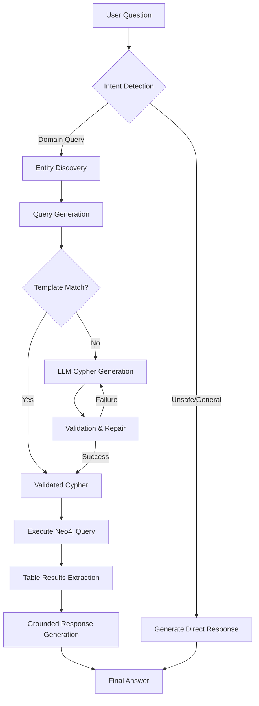

# Vector-less RAG: Graph-Based Query System Guide

This guide explains the "Vector-less" Retrieval-Augmented Generation (RAG) architecture used in the Graph-Based Query System. Unlike traditional RAG which relies heavily on vector similarity for document retrieval, this system leverages **structured graph data** and **deterministic query generation** to provide precise, verifiable answers for business-critical Order-to-Cash (O2C) data.

## Architecture Overview

The system is powered by **LangGraph**, which coordinates a multi-step workflow to transform natural language into validated Cypher queries and grounded responses.

### LangGraph Workflow

---

## 1. Intent Detection
The first layer of the system analyzes the user's input to determine if it is:
- **Domain Query**: Specific to the Order-to-Cash data (e.g., "Show orders for customer X").
- **General**: Non-business queries (e.g., "Hello", "What's the weather?").
- **Unsafe**: Potential injection or destructive requests (e.g., "Delete all customers").

**Implementation**: `detect_intent` in `backend/agent/langgraph_agent.py`.

---

## 2. Entity Discovery
To ensure the LLM generates accurate queries, the system identifies key IDs (SalesOrders, Customers, Plants) within the question.

- **Regex Extraction**: Identifies potential numeric IDs (e.g., `740506`).
- **Semantic Fallback**: If no IDs are found, the system performs a vector search against `Product` and `Customer` indices in Neo4j to find relevant nodes.

**Implementation**: `discover_entities` in `backend/agent/langgraph_agent.py`.

---

## 3. Hybrid Query Generation (Fast Path vs. LLM Path)
The system uses a two-pronged approach to generate Cypher queries:

### Fast Path: Deterministic Templates
For common questions, we avoid LLM hallucinations entirely by using pre-defined regex templates.
- **Summary of an Order**: `MATCH (o:SalesOrder {id: '...'})...`
- **Customer Address**: `MATCH (c:Customer {id: '...'})-[:HAS_ADDRESS]->(a:Address)...`

### LLM Path: Dynamic Cypher Generation
For complex or unique questions, the system uses an LLM (e.g., `deepseek-r1:1.5b`) provided with the full **Graph Schema** and **Discovered Entities**.

**Implementation**: `generate_cypher` and `QUERY_TEMPLATES`.

---

## 4. Validation & Read-Only Enforcement
Before execution, every query is checked against a blacklist of keywords (`DELETE`, `MERGE`, `CREATE`) to ensure the system remains read-only. If a syntax error occurs during execution, the LangGraph workflow allows for a **Repair Loop** where the LLM adjusts the query based on the error message.

**Implementation**: `validate_cypher` and `condition_after_execution`.

---

## 5. Execution & Grounding
The final response is never "hallucinated." It is strictly grounded in the retrieved data.

1.  **Execution**: The Cypher query is executed against the Neo4j database.
2.  **Table Extraction**: Results are flattened into a structured table format for both the UI and the LLM.
3.  **Grounded Response**: The LLM is given the user's question and the *exact data table* retrieved from Neo4j. It is instructed to answer **ONLY** using the provided data.

**Implementation**: `execute_cypher` and `generate_response`.

---

## Key Benefits
- **Zero Hallucination**: Every claim in the final response can be traced back to a specific cell in the Neo4j result table.
- **UI Friendly**: The same table data used by the LLM is sent to the frontend to render high-fidelity data grids and graph visualizations.
- **Performance**: Deterministic templates handle common queries instantly without LLM latency.
